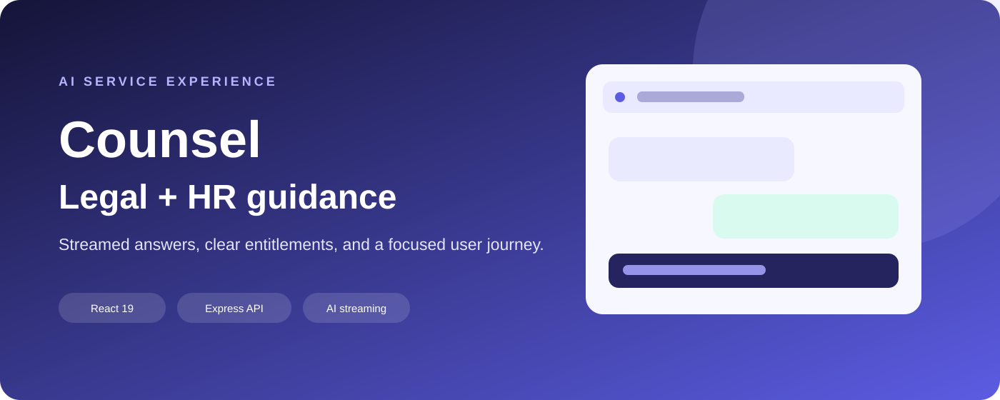
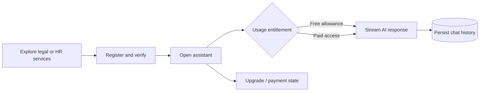

# Counsel

> An AI-assisted legal and HR guidance experience with streamed conversations, usage entitlements, and a focused service journey.

## Overview

Counsel combines a polished React service website with an authenticated AI assistant for legal and HR questions. Users can register, verify access, start a guided conversation, receive streamed responses, review recent chat history, and move from a limited free allowance to a paid entitlement. The server keeps identity, usage, chat history, and payment state behind a small Express API.

## My contribution

- React 19 information architecture for legal services, HR services, about, contact, authentication, and chat
- Express 5 API with JWT-protected routes and bcrypt password hashing
- OpenAI chat-completion integration with streaming responses and usage limits
- Prisma/PostgreSQL data model for users, conversations, usage counters, and payment records
- Clear free-versus-paid entitlement behavior with friendly upgrade and error states
- Reusable navigation, service content, chat components, responsive styling, and production build setup

## Skills demonstrated

| Area | Applied |
| --- | --- |
| React | Route-based service pages, protected screens, chat UI, responsive components |
| AI integration | OpenAI completion calls, streamed tokens, history persistence, usage controls |
| Backend | Express routes, middleware, error handling, JSON API contracts |
| Data | Prisma schema, PostgreSQL relations, usage counters, payment state |
| Authentication | JWT sessions, password hashing, protected chat and history endpoints |
| Product UX | Service discovery, free-limit messaging, loading states, upgrade-ready journey |

## Representative flow

## Technical stack

React 19 · React Router · Axios · Node.js · Express 5 · OpenAI SDK · Prisma 6 · PostgreSQL · JWT · bcrypt · React Icons.

See [architecture](docs/ARCHITECTURE.md), [user flows](docs/USER-FLOWS.md), [security policy](SECURITY.md), [screenshot guide](docs/SCREENSHOT-GUIDE.md), and [GitHub setup](docs/GITHUB-SETUP.md).
"# counsel" 
