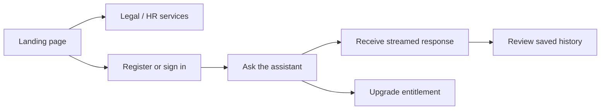

# User flows

## Conversation lifecycle

1. The visitor selects a service area and creates an account.
2. The API verifies the token and checks the user's remaining allowance or paid entitlement.
3. The server sends a constrained prompt to the AI provider and streams the response to the client.
4. The conversation is saved with usage metadata for the history view.
5. Upgrade/payment state changes the server-side entitlement; the UI reflects the new access level.
